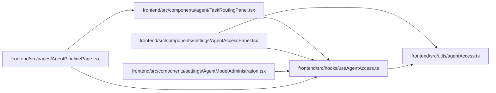

# useAgentAccess Module

**Path:** `frontend/src/hooks/useAgentAccess.ts`

## Description

_Auto-generated from `frontend/src/hooks/useAgentAccess.ts`._

## Imports

| Source | Symbols |
|--------|---------|
| `../utils/agentAccess` | `AGENT_API_KEY_CHANGED_EVENT`, `hasAgentApiKey` |
| `react` | `useEffect`, `useState` |

## Module Signals

| Signal | Values |
|--------|--------|
| Exports | `useAgentAccess` |

## Local dependency map

<!-- Auto-generated local dependency summary. Do not edit by hand. -->

### Internal neighbors

| Direction | Module |
|---|---|
| Inbound | [TaskRoutingPanel](../modules/TaskRoutingPanel.md) |
| Inbound | [AgentAccessPanel](../modules/AgentAccessPanel.md) |
| Inbound | [AgentModelAdministration](../modules/AgentModelAdministration.md) |
| Inbound | [AgentPipelinePage](../modules/AgentPipelinePage.md) |
| Outbound | [agentAccess](../modules/agentAccess.md) |

### External packages

| Language | Used packages | Undeclared packages |
|---|---:|---:|
| typescript | 1 | 0 |

## Functions

| Function | Signature | Decorators | Description |
|----------|-----------|------------|-------------|
| `useAgentAccess` | `()` | — | — |
