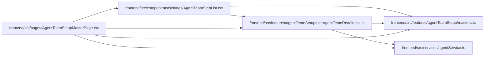

# useAgentTeamReadiness Module

**Path:** `frontend/src/features/agentTeamSetup/useAgentTeamReadiness.ts`

## Description

_Auto-generated from `frontend/src/features/agentTeamSetup/useAgentTeamReadiness.ts`._

## Imports

| Source | Symbols |
|--------|---------|
| `../../services/agentService` | `agentService` |
| `./masters` | `stepProgress`, `stepsById` |
| `@tanstack/react-query` | `useQuery` |

## Module Signals

| Signal | Values |
|--------|--------|
| Exports | `useAgentTeamReadiness` |

## Local dependency map

<!-- Auto-generated local dependency summary. Do not edit by hand. -->

### Internal neighbors

| Direction | Module |
|---|---|
| Inbound | [AgentTeamStepList](../modules/AgentTeamStepList.md) |
| Inbound | [AgentTeamSetupMasterPage](../modules/AgentTeamSetupMasterPage.md) |
| Outbound | [agentTeamSetup_masters](../modules/agentTeamSetup_masters.md) |
| Outbound | [agentService](../modules/agentService.md) |

### External packages

| Language | Used packages | Undeclared packages |
|---|---:|---:|
| typescript | 1 | 0 |

## Functions

| Function | Signature | Decorators | Description |
|----------|-----------|------------|-------------|
| `useAgentTeamReadiness` | `(topologyKey: string)` | — | — |
