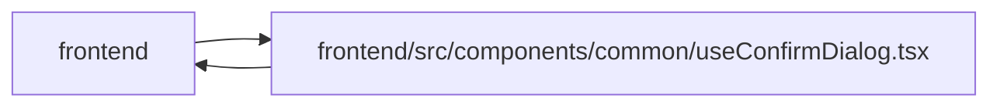

# useConfirmDialog Module

**Path:** `frontend/src/components/common/useConfirmDialog.tsx`

## Description

_Auto-generated from `frontend/src/components/common/useConfirmDialog.tsx`._

## Imports

| Source | Symbols |
|--------|---------|
| `./ConfirmDialog` | `ConfirmDialog`, `ConfirmDialogTone` |
| `react` | `useState`, `ReactNode` |

## Module Signals

| Signal | Values |
|--------|--------|
| Exports | `ConfirmationRequest`, `useConfirmDialog` |

## Local dependency map

<!-- Auto-generated local dependency summary. Do not edit by hand. -->

> Module-level dependencies exceed the generated-diagram limits, so the diagram and table below group them by top-level package. Counts report the number of module neighbors in each package.

### Internal neighbors

| Direction | Module |
|---|---|
| Inbound | `frontend` (11) |
| Outbound | `frontend` (1) |

### External packages

| Language | Used packages | Undeclared packages |
|---|---:|---:|
| typescript | 1 | 0 |

> All 12 module neighbor(s) are summarized by package because the module-level view exceeds the 12-node limit.

## Classes

| Class | Kind | Line | Bases / Target | Description |
|-------|------|------|----------------|-------------|
| [ConfirmationRequest](../entities/ConfirmationRequest.md) | Class | 6 | — | — |

## Functions

| Function | Signature | Decorators | Description |
|----------|-----------|------------|-------------|
| `useConfirmDialog` | `()` | — | Render-once controller for destructive confirmations local to a feature. |
