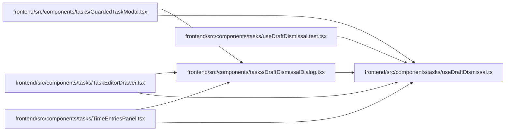

# useDraftDismissal Module

**Path:** `frontend/src/components/tasks/useDraftDismissal.ts`

## Description

_Auto-generated from `frontend/src/components/tasks/useDraftDismissal.ts`._

Create, list edit, subtask and drawer forms share dirty/pending dismissal state. Pending work blocks unmount; declined dismissal preserves the draft. Explicit discard clears recovery storage, and clean forms close without an unnecessary prompt.

## Imports

| Source | Symbols |
|--------|---------|
| `react` | `useCallback`, `useEffect`, `useRef`, `useState` |

## Module Signals

| Signal | Values |
|--------|--------|
| Exports | `useDraftDismissal` |

## Local dependency map

<!-- Auto-generated local dependency summary. Do not edit by hand. -->

### Internal neighbors

| Direction | Module |
|---|---|
| Inbound | [DraftDismissalDialog](../modules/DraftDismissalDialog.md) |
| Inbound | [GuardedTaskModal](../modules/GuardedTaskModal.md) |
| Inbound | [TaskEditorDrawer](../modules/TaskEditorDrawer.md) |
| Inbound | [TimeEntriesPanel](../modules/TimeEntriesPanel.md) |
| Inbound | [useDraftDismissal.test](../modules/useDraftDismissal.test.md) |

### External packages

| Language | Used packages | Undeclared packages |
|---|---:|---:|
| typescript | 1 | 0 |

## Functions

| Function | Signature | Decorators | Description |
|----------|-----------|------------|-------------|
| `useDraftDismissal` | `(onClose: () => void)` | — | — |