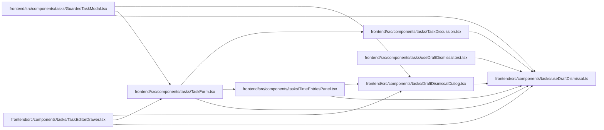

# useDraftDismissal Module

**Path:** `frontend/src/components/tasks/useDraftDismissal.ts`

## Description

Mounted-scope guards suppress obsolete close, discard and pending callbacks after an editor is removed. Existing dirty and pending confirmation, before-unload and sign-out controls retain their behavior. The reusable active-mount check also protects late write completions in task, comment and time editors.

## Imports

| Source | Symbols |
|--------|---------|
| `react` | `useCallback`, `useEffect`, `useRef`, `useState` |

## Module Signals

| Signal | Values |
|--------|--------|
| Exports | `useActiveMount`, `useDraftDismissal` |

## Local dependency map

<!-- Auto-generated local dependency summary. Do not edit by hand. -->

### Internal neighbors

| Direction | Module |
|---|---|
| Inbound | [DraftDismissalDialog](../modules/DraftDismissalDialog.md) |
| Inbound | [GuardedTaskModal](../modules/GuardedTaskModal.md) |
| Inbound | [TaskDiscussion](../modules/TaskDiscussion.md) |
| Inbound | [TaskEditorDrawer](../modules/TaskEditorDrawer.md) |
| Inbound | [TaskForm](../modules/TaskForm.md) |
| Inbound | [TimeEntriesPanel](../modules/TimeEntriesPanel.md) |
| Inbound | [useDraftDismissal.test](../modules/useDraftDismissal.test.md) |

### External packages

| Language | Used packages | Undeclared packages |
|---|---:|---:|
| typescript | 1 | 0 |

## Functions

| Function | Signature | Decorators | Description |
|----------|-----------|------------|-------------|
| `useActiveMount` | `()` | — | — |
| `useDraftDismissal` | `(onClose: () => void)` | — | — |