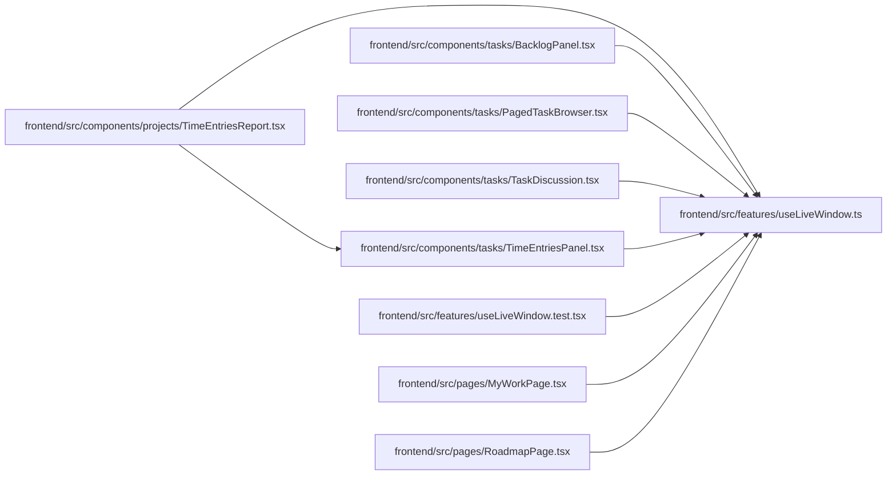

# useLiveWindow Module

**Path:** `frontend/src/features/useLiveWindow.ts`

## Description

Live paged work retains four pages with one separate foreground head-discovery read. Cursor progress and upper bounds are validated; missing or cyclic continuations fail visibly. Duplicate rows resolve to the highest observed version. Retired windows expose explicit latest-window navigation without replacing selected task state or editor drafts. Reset opens a fresh query generation rather than replaying an obsolete cursor.

## Imports

| Source | Symbols |
|--------|---------|
| `@tanstack/react-query` | `useInfiniteQuery`, `useQuery`, `useQueryClient`, `InfiniteData`, `QueryKey`, `UseInfiniteQueryOptions` |
| `react` | `useState` |

## Module Signals

| Signal | Values |
|--------|--------|
| Exports | `deduplicateWindow`, `useLiveWindow`, `validateWindowCursor` |

## Local dependency map

<!-- Auto-generated local dependency summary. Do not edit by hand. -->

### Internal neighbors

| Direction | Module |
|---|---|
| Inbound | [TimeEntriesReport](../modules/TimeEntriesReport.md) |
| Inbound | [BacklogPanel](../modules/BacklogPanel.md) |
| Inbound | [PagedTaskBrowser](../modules/PagedTaskBrowser.md) |
| Inbound | [TaskDiscussion](../modules/TaskDiscussion.md) |
| Inbound | [TimeEntriesPanel](../modules/TimeEntriesPanel.md) |
| Inbound | [useLiveWindow.test](../modules/useLiveWindow.test.md) |
| Inbound | [MyWorkPage](../modules/MyWorkPage.md) |
| Inbound | [RoadmapPage](../modules/RoadmapPage.md) |

### External packages

| Language | Used packages | Undeclared packages |
|---|---:|---:|
| typescript | 2 | 0 |

## Functions

| Function | Signature | Decorators | Description |
|----------|-----------|------------|-------------|
| `useLiveWindow` | `(options: UseInfiniteQueryOptions<T, Error, InfiniteData<T, P>, QueryKey, P>)` | — | — |
| `validateWindowCursor` | `(page: unknown, current: unknown, next: unknown)` | — | — |
| `deduplicateWindow` | `(data: InfiniteData<T, P>) -> InfiniteData<T, P>` | — | — |
