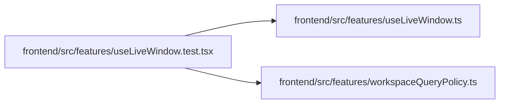

# useLiveWindow.test Module

**Path:** `frontend/src/features/useLiveWindow.test.tsx`

## Description

_Auto-generated from `frontend/src/features/useLiveWindow.test.tsx`._

## Imports

| Source | Symbols |
|--------|---------|
| `./useLiveWindow` | `useLiveWindow`, `validateWindowCursor`, `deduplicateWindow` |
| `./workspaceQueryPolicy` | `createWorkspaceQueryClient`, `installWorkspaceQueryPolicy` |
| `@tanstack/react-query` | `QueryClientProvider` |
| `@testing-library/react` | `act`, `waitFor`, `renderHook` |
| `vitest` | `expect`, `it`, `vi` |

## Module Signals

| Signal | Values |
|--------|--------|
| Module calls | `it`, `it.each([0, -1, NaN, undefined])`, `it`, `it`, `it` |

## Local dependency map

<!-- Auto-generated local dependency summary. Do not edit by hand. -->

### Internal neighbors

| Direction | Module |
|---|---|
| Outbound | [useLiveWindow](../modules/useLiveWindow.md) |
| Outbound | [workspaceQueryPolicy](../modules/workspaceQueryPolicy.md) |

### External packages

| Language | Used packages | Undeclared packages |
|---|---:|---:|
| typescript | 3 | 0 |
