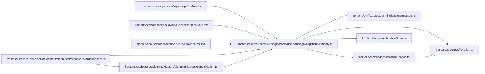

# usePlanningNavigationSummary Module

**Path:** `frontend/src/features/planningMasters/usePlanningNavigationSummary.ts`

## Description

_Auto-generated from `frontend/src/features/planningMasters/usePlanningNavigationSummary.ts`._

## Imports

| Source | Symbols |
|--------|---------|
| `../../services/iterationService` | `iterationService` |
| `../../store/iterationStore` | `useIterationStore` |
| `../../types/iteration` | `Iteration` |
| `./masters` | `deriveStatus`, `readiness`, `PlanReadiness` |
| `@tanstack/react-query` | `useQuery` |
| `react` | `useMemo` |

## Module Signals

| Signal | Values |
|--------|--------|
| Exports | `planningNavigationSummaryKey`, `usePlanningNavigationSummary` |

## Local dependency map

<!-- Auto-generated local dependency summary. Do not edit by hand. -->

### Internal neighbors

| Direction | Module |
|---|---|
| Inbound | [AppTopNav](../modules/AppTopNav.md) |
| Inbound | [SidebarIterationCard](../modules/SidebarIterationCard.md) |
| Inbound | [IdentityProvider.test](../modules/IdentityProvider.test.md) |
| Inbound | [planningNavigationInvalidation.test](../modules/planningNavigationInvalidation.test.md) |
| Inbound | [planningNavigationInvalidation](../modules/planningNavigationInvalidation.md) |
| Outbound | [planningMasters_masters](../modules/planningMasters_masters.md) |
| Outbound | [iterationService](../modules/iterationService.md) |
| Outbound | [iterationStore](../modules/iterationStore.md) |
| Outbound | [types_iteration](../modules/types_iteration.md) |

### External packages

| Language | Used packages | Undeclared packages |
|---|---:|---:|
| typescript | 2 | 0 |

## Functions

| Function | Signature | Decorators | Description |
|----------|-----------|------------|-------------|
| `planningNavigationSummaryKey` | `(iterationId: number)` | — | — |
| `usePlanningNavigationSummary` | `()` | — | — |
