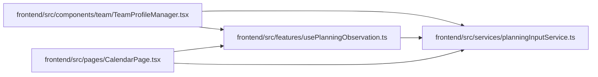

# usePlanningObservation Module

**Path:** `frontend/src/features/usePlanningObservation.ts`

## Description

Editor observations are retained with drafts. Only explicit conflict reapply reads or successful writes advance them; obsolete reads are ignored. The hook separates context loading from user input.

## Imports

| Source | Symbols |
|--------|---------|
| `../services/planningInputService` | `planningInputService`, `ObservedPlanningInput`, `PlanningInputKind` |
| `react` | `useCallback`, `useEffect`, `useRef`, `useState` |

## Module Signals

| Signal | Values |
|--------|--------|
| Exports | `usePlanningObservation` |

## Local dependency map

<!-- Auto-generated local dependency summary. Do not edit by hand. -->

### Internal neighbors

| Direction | Module |
|---|---|
| Inbound | [TeamProfileManager](../modules/TeamProfileManager.md) |
| Inbound | [CalendarPage](../modules/CalendarPage.md) |
| Outbound | [planningInputService](../modules/planningInputService.md) |

### External packages

| Language | Used packages | Undeclared packages |
|---|---:|---:|
| typescript | 1 | 0 |

## Functions

| Function | Signature | Decorators | Description |
|----------|-----------|------------|-------------|
| `usePlanningObservation` | `()` | — | — |