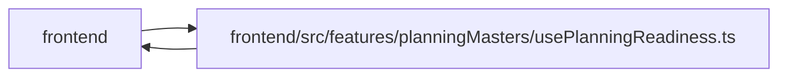

# usePlanningReadiness Module

**Path:** `frontend/src/features/planningMasters/usePlanningReadiness.ts`

## Description

_Auto-generated from `frontend/src/features/planningMasters/usePlanningReadiness.ts`._

## Imports

| Source | Symbols |
|--------|---------|
| `../../services/ganttService` | `ganttService` |
| `../../services/iterationService` | `iterationService` |
| `../../services/taskService` | `taskService` |
| `../../services/teamService` | `teamService` |
| `../../services/triageService` | `triageService` |
| `../../store/iterationStore` | `useIterationStore` |
| `../../types/gantt` | `GanttResponse` |
| `../../types/iteration` | `Iteration` |
| `../../types/task` | `Task` |
| `../../types/team` | `TeamMember` |
| `./masters` | `deriveStatus`, `nextStep`, `readiness`, `PlanReadiness` |
| `./planningTaskIssues` | `hasPositivePlanningEffort`, `isPlanningLeafTask` |
| `@tanstack/react-query` | `useQuery` |
| `react` | `useEffect`, `useMemo` |

## Module Signals

| Signal | Values |
|--------|--------|
| Exports | `PlanningQueryFeedback`, `PlanningTeamMember`, `countPlanningExceptions`, `enrichPlanningTeamMembers`, `flattenTasks`, `hasSavedPlanningSchedule`, `planningLeafTasks`, `usePlanningReadiness` |
| Constants | `HOURS_PER_DAY`, `ISO_DATE`, `MILLISECONDS_PER_DAY`, `finitePositive` |

## Local dependency map

<!-- Auto-generated local dependency summary. Do not edit by hand. -->

> Module-level dependencies exceed the generated-diagram limits, so the diagram and table below group them by top-level package. Counts report the number of module neighbors in each package.

### Internal neighbors

| Direction | Module |
|---|---|
| Inbound | `frontend` (6) |
| Outbound | `frontend` (12) |

### External packages

| Language | Used packages | Undeclared packages |
|---|---:|---:|
| typescript | 2 | 0 |

> All 18 module neighbor(s) are summarized by package because the module-level view exceeds the 12-node limit.

## Classes

| Class | Kind | Line | Bases / Target | Description |
|-------|------|------|----------------|-------------|
| [PlanningReadinessOptions](../entities/PlanningReadinessOptions.md) | Type alias | 20 | — | — |
| [PlanningTeamMember](../entities/PlanningTeamMember.md) | Type alias | 29 | — | — |
| [PlanningQueryFeedback](../entities/PlanningQueryFeedback.md) | Type alias | 34 | — | — |
| [QueryFeedbackSource](../entities/QueryFeedbackSource.md) | Type alias | 47 | — | — |

## Functions

| Function | Signature | Decorators | Description |
|----------|-----------|------------|-------------|
| `flattenTasks` | `(list: Task[] = []) -> Task[]` | — | — |
| `planningLeafTasks` | `(list: Task[] = []) -> Task[]` | — | — |
| `enrichPlanningTeamMembers` | `({     members,     tasks,     iteration,     gantt, }: {     members: TeamMember[];     tasks: Task[];     iteration: Iteration \| null;     gantt?: GanttResponse; }) -> PlanningTeamMember[]` | — | — |
| `hasSavedPlanningSchedule` | `(tasks: Task[])` | — | — |
| `countPlanningExceptions` | `(tasks: Task[], members: PlanningTeamMember[])` | — | — |
| `usePlanningReadiness` | `({     includeInbox = false,     autoSelectFirst = false, }: PlanningReadinessOptions = {})` | — | — |
