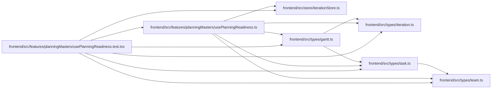

# usePlanningReadiness.test Module

**Path:** `frontend/src/features/planningMasters/usePlanningReadiness.test.tsx`

## Description

_Auto-generated from `frontend/src/features/planningMasters/usePlanningReadiness.test.tsx`._

## Imports

| Source | Symbols |
|--------|---------|
| `../../store/iterationStore` | `useIterationStore` |
| `../../types/gantt` | `GanttResponse`, `GanttTask` |
| `../../types/iteration` | `Iteration` |
| `../../types/task` | `Task` |
| `../../types/team` | `TeamMember` |
| `./usePlanningReadiness` | `countPlanningExceptions`, `enrichPlanningTeamMembers`, `hasSavedPlanningSchedule`, `planningLeafTasks`, `usePlanningReadiness` |
| `@tanstack/react-query` | `QueryClient`, `QueryClientProvider` |
| `@testing-library/react` | `act`, `renderHook`, `waitFor` |
| `react` | `ReactNode` |
| `vitest` | `beforeEach`, `describe`, `expect`, `it`, `vi` |

## Module Signals

| Signal | Values |
|--------|--------|
| Constants | `serviceMocks`, `iteration`, `member` |
| Module calls | `serviceMocks = hoisted`, `mock`, `mock`, `mock`, `mock`, `mock`, `describe`, `describe` |

## Local dependency map

<!-- Auto-generated local dependency summary. Do not edit by hand. -->

### Internal neighbors

| Direction | Module |
|---|---|
| Outbound | [usePlanningReadiness](../modules/usePlanningReadiness.md) |
| Outbound | [iterationStore](../modules/iterationStore.md) |
| Outbound | [types_gantt](../modules/types_gantt.md) |
| Outbound | [types_iteration](../modules/types_iteration.md) |
| Outbound | [types_task](../modules/types_task.md) |
| Outbound | [types_team](../modules/types_team.md) |

### External packages

| Language | Used packages | Undeclared packages |
|---|---:|---:|
| typescript | 4 | 0 |
