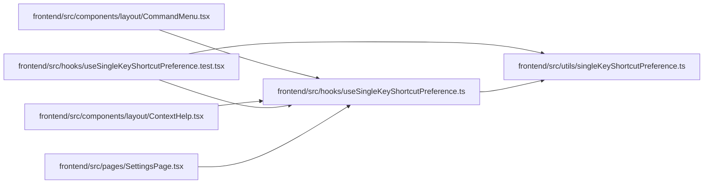

# useSingleKeyShortcutPreference Module

**Path:** `frontend/src/hooks/useSingleKeyShortcutPreference.ts`

## Description

_Auto-generated from `frontend/src/hooks/useSingleKeyShortcutPreference.ts`._

## Imports

| Source | Symbols |
|--------|---------|
| `../utils/singleKeyShortcutPreference` | `readSingleKeyShortcutsEnabled`, `SINGLE_KEY_SHORTCUTS_CHANGED_EVENT`, `SINGLE_KEY_SHORTCUTS_STORAGE_KEY`, `writeSingleKeyShortcutsEnabled` |
| `react` | `useCallback`, `useEffect`, `useState` |

## Module Signals

| Signal | Values |
|--------|--------|
| Exports | `useSingleKeyShortcutPreference` |

## Local dependency map

<!-- Auto-generated local dependency summary. Do not edit by hand. -->

### Internal neighbors

| Direction | Module |
|---|---|
| Inbound | [CommandMenu](../modules/CommandMenu.md) |
| Inbound | [ContextHelp](../modules/ContextHelp.md) |
| Inbound | [useSingleKeyShortcutPreference.test](../modules/useSingleKeyShortcutPreference.test.md) |
| Inbound | [SettingsPage](../modules/SettingsPage.md) |
| Outbound | [singleKeyShortcutPreference](../modules/singleKeyShortcutPreference.md) |

### External packages

| Language | Used packages | Undeclared packages |
|---|---:|---:|
| typescript | 1 | 0 |

## Functions

| Function | Signature | Decorators | Description |
|----------|-----------|------------|-------------|
| `useSingleKeyShortcutPreference` | `()` | — | — |
