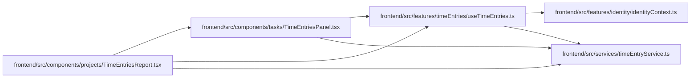

# useTimeEntries Module

**Path:** `frontend/src/features/timeEntries/useTimeEntries.ts`

## Description

_Auto-generated from `frontend/src/features/timeEntries/useTimeEntries.ts`._

## Imports

| Source | Symbols |
|--------|---------|
| `../../services/timeEntryService` | `timeEntryService` |
| `../identity/identityContext` | `useIdentity` |
| `@tanstack/react-query` | `useQuery` |

## Module Signals

| Signal | Values |
|--------|--------|
| Exports | `useTimeEntries` |

## Local dependency map

<!-- Auto-generated local dependency summary. Do not edit by hand. -->

### Internal neighbors

| Direction | Module |
|---|---|
| Inbound | [TimeEntriesReport](../modules/TimeEntriesReport.md) |
| Inbound | [TimeEntriesPanel](../modules/TimeEntriesPanel.md) |
| Outbound | [identityContext](../modules/identityContext.md) |
| Outbound | [timeEntryService](../modules/timeEntryService.md) |

### External packages

| Language | Used packages | Undeclared packages |
|---|---:|---:|
| typescript | 1 | 0 |

## Functions

| Function | Signature | Decorators | Description |
|----------|-----------|------------|-------------|
| `useTimeEntries` | `()` | — | — |
