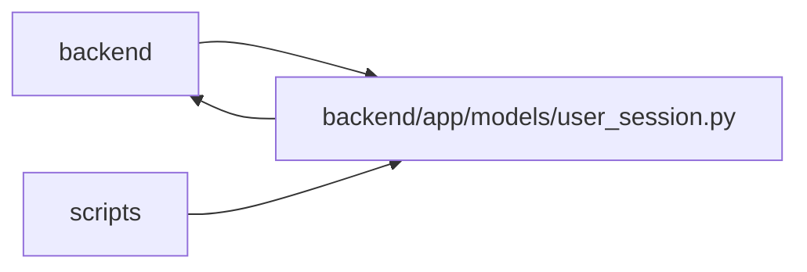

# user_session Module

**Path:** `backend/app/models/user_session.py`

## Description

_Auto-generated from `backend/app/models/user_session.py`._

## Imports

| Source | Symbols |
|--------|---------|
| `app.database` | `Base` |
| `app.models.identity` | `Principal` |
| `app.models.plan_share` | `PlanShare` |
| `app.models.project` | `ProjectUpdateEntry` |
| `app.models.saved_view` | `SavedView` |
| `app.utils.time` | `UTCDateTime`, `utc_now` |
| `datetime` | `datetime` |
| `secrets` | `secrets` |
| `sqlalchemy` | `ForeignKey`, `String` |
| `sqlalchemy.orm` | `Mapped`, `mapped_column`, `relationship` |
| `typing` | `TYPE_CHECKING` |

## Local dependency map

<!-- Auto-generated local dependency summary. Do not edit by hand. -->

> Module-level dependencies exceed the generated-diagram limits, so the diagram and table below group them by top-level package. Counts report the number of module neighbors in each package.

### Internal neighbors

| Direction | Module |
|---|---|
| Inbound | `backend` (23) |
| Inbound | `scripts` (1) |
| Outbound | `backend` (6) |

### External packages

| Language | Used packages | Undeclared packages |
|---|---:|---:|
| python | 1 | 0 |

> All 27 module neighbor(s) are summarized by package because the module-level view exceeds the 12-node limit.

## Classes

| Class | Line | Bases | Description |
|-------|------|-------|-------------|
| [UserSession](../entities/user_session_UserSession.md) | 16 | `Base` | Opaque browser identity with non-authoritative request audit metadata. |
