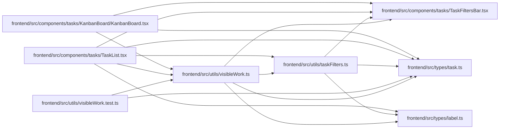

# visibleWork Module

**Path:** `frontend/src/utils/visibleWork.ts`

## Description

_Auto-generated from `frontend/src/utils/visibleWork.ts`._

List and Board use one filtered tree and actionable-leaf projection. Parent context remains discoverable without increasing leaf counts or bringing unmatched siblings into a Board card.

## Imports

| Source | Symbols |
|--------|---------|
| `../components/tasks/TaskFiltersBar` | `TaskFilters` |
| `../types/label` | `LabelGroup` |
| `../types/task` | `Task` |
| `./taskFilters` | `filterTaskWithChildren` |

## Module Signals

| Signal | Values |
|--------|--------|
| Exports | `VisibleLeaf`, `selectVisibleWork` |

## Local dependency map

<!-- Auto-generated local dependency summary. Do not edit by hand. -->

### Internal neighbors

| Direction | Module |
|---|---|
| Inbound | [KanbanBoard](../modules/KanbanBoard.md) |
| Inbound | [TaskList](../modules/TaskList.md) |
| Inbound | [visibleWork.test](../modules/visibleWork.test.md) |
| Outbound | [TaskFiltersBar](../modules/TaskFiltersBar.md) |
| Outbound | [types_label](../modules/types_label.md) |
| Outbound | [types_task](../modules/types_task.md) |
| Outbound | [taskFilters](../modules/taskFilters.md) |

## Classes

| Class | Kind | Line | Bases / Target | Description |
|-------|------|------|----------------|-------------|
| [VisibleLeaf](../entities/VisibleLeaf.md) | Type alias | 6 | — | — |

## Functions

| Function | Signature | Decorators | Description |
|----------|-----------|------------|-------------|
| `selectVisibleWork` | `(tasks: Task[], filters: TaskFilters, groups: LabelGroup[] = [])` | — | — |
