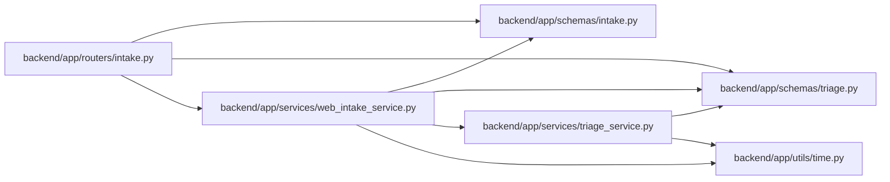

# web_intake_service Module

**Path:** `backend/app/services/web_intake_service.py`

## Description

Controlled external web intake service.

## Imports

| Source | Symbols |
|--------|---------|
| `app.schemas.intake` | `WebIntakeRequest` |
| `app.schemas.triage` | `TriageItemCreate` |
| `app.services.triage_service` | `TriageService` |
| `app.utils.time` | `utc_now` |
| `dataclasses` | `dataclass` |
| `datetime` | `datetime`, `timedelta` |
| `hmac` | `hmac` |
| `math` | `math` |
| `sqlalchemy.ext.asyncio` | `AsyncSession` |
| `time` | `time` |
| `typing` | `Callable`, `Optional` |

## Local dependency map

<!-- Auto-generated local dependency summary. Do not edit by hand. -->

### Internal neighbors

| Direction | Module |
|---|---|
| Inbound | [routers_intake](../modules/routers_intake.md) |
| Outbound | [schemas_intake](../modules/schemas_intake.md) |
| Outbound | [schemas_triage](../modules/schemas_triage.md) |
| Outbound | [triage_service](../modules/triage_service.md) |
| Outbound | [time](../modules/time.md) |

### External packages

| Language | Used packages | Undeclared packages |
|---|---:|---:|
| python | 1 | 0 |

## Classes

| Class | Line | Bases | Description |
|-------|------|-------|-------------|
| [WebIntakeConfigurationError](../entities/WebIntakeConfigurationError.md) | 17 | `RuntimeError` | Raised when the intake endpoint is not configured. |
| [WebIntakeUnauthorizedError](../entities/WebIntakeUnauthorizedError.md) | 21 | `PermissionError` | Raised when an intake request is not authenticated. |
| [WebIntakeRateLimitError](../entities/WebIntakeRateLimitError.md) | 25 | `RuntimeError` | Raised when an intake requester exceeds the configured rate limit. |
| [_RateLimitWindow](../entities/RateLimitWindow.md) | 38 | — | — |
| [WebIntakeRateLimiter](../entities/WebIntakeRateLimiter.md) | 43 | — | In-process fixed-window rate limiter keyed by client IP. |
| [WebIntakeService](../entities/WebIntakeService.md) | 103 | — | Validate controlled intake submissions and create triage items. |
