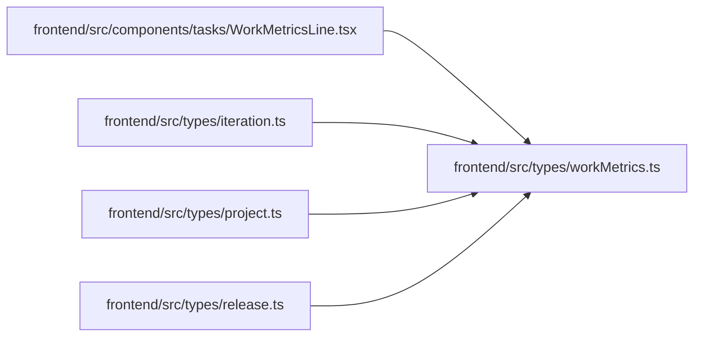

# workMetrics Module

**Path:** `frontend/src/types/workMetrics.ts`

## Description

_Auto-generated from `frontend/src/types/workMetrics.ts`._

## Module Signals

| Signal | Values |
|--------|--------|
| Exports | `WorkMetrics` |

## Local dependency map

<!-- Auto-generated local dependency summary. Do not edit by hand. -->

### Internal neighbors

| Direction | Module |
|---|---|
| Inbound | [WorkMetricsLine](../modules/WorkMetricsLine.md) |
| Inbound | [types_iteration](../modules/types_iteration.md) |
| Inbound | [types_project](../modules/types_project.md) |
| Inbound | [types_release](../modules/types_release.md) |

## Classes

| Class | Kind | Line | Bases / Target | Description |
|-------|------|------|----------------|-------------|
| [WorkMetrics](../entities/WorkMetrics.md) | Class | 1 | — | — |
