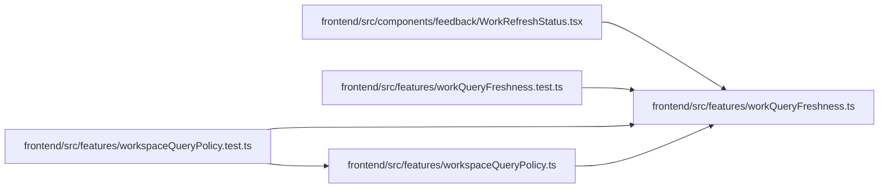

# workQueryFreshness Module

**Path:** `frontend/src/features/workQueryFreshness.ts`

## Description

Unauthorized query failures remove cached server data and suppress automatic retries and polling. Live retained-window heads participate in declared mutation effects through their owning root. Visible active windows retain the foreground interval and bounded error backoff; immutable histories and editor observations remain distinct.

## Imports

| Source | Symbols |
|--------|---------|
| `@tanstack/react-query` | `QueryClient` |

## Module Signals

| Signal | Values |
|--------|--------|
| Exports | `WORKSPACE_QUERY_POLICIES`, `WORK_QUERY_KEYS`, `installWorkFreshness` |
| Constants | `ROOTS_BY_POLICY`, `WORKSPACE_QUERY_POLICIES`, `WORK_QUERY_KEYS`, `MUTATION_ROOT_EFFECTS` |
| Module calls | `WORKSPACE_QUERY_POLICIES = fromEntries` |

## Local dependency map

<!-- Auto-generated local dependency summary. Do not edit by hand. -->

### Internal neighbors

| Direction | Module |
|---|---|
| Inbound | [WorkRefreshStatus](../modules/WorkRefreshStatus.md) |
| Inbound | [workQueryFreshness.test](../modules/workQueryFreshness.test.md) |
| Inbound | [workspaceQueryPolicy.test](../modules/workspaceQueryPolicy.test.md) |
| Inbound | [workspaceQueryPolicy](../modules/workspaceQueryPolicy.md) |

### External packages

| Language | Used packages | Undeclared packages |
|---|---:|---:|
| typescript | 1 | 0 |

## Classes

| Class | Kind | Line | Bases / Target | Description |
|-------|------|------|----------------|-------------|
| [QueryPolicy](../entities/QueryPolicy.md) | Type alias | 3 | — | — |

## Functions

| Function | Signature | Decorators | Description |
|----------|-----------|------------|-------------|
| `installWorkFreshness` | `(client: QueryClient)` | — | — |