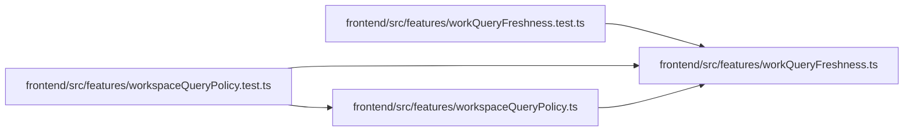

# workQueryFreshness Module

**Path:** `frontend/src/features/workQueryFreshness.ts`

## Description

_Auto-generated from `frontend/src/features/workQueryFreshness.ts`._

An explicit workspace registry separates live work, immutable history, editor snapshots, on-demand reference data, settings and identity ownership. Eligible active live queries refresh every 30 seconds while visible, retaining the existing failure backoff. Hidden, disabled and unauthorized queries stop polling. Automatic refresh does not replay more than five accumulated pages or replace editor/history snapshots. Explicit mutation effects limit unrelated settings traffic; unmapped mutations retain legacy work invalidation until adoption is complete.

## Imports

| Source | Symbols |
|--------|---------|
| `@tanstack/react-query` | `QueryClient` |

## Module Signals

| Signal | Values |
|--------|--------|
| Exports | `WORKSPACE_QUERY_POLICIES`, `WORK_QUERY_KEYS`, `installWorkFreshness` |
| Constants | `ROOTS_BY_POLICY`, `WORKSPACE_QUERY_POLICIES`, `WORK_QUERY_KEYS`, `MUTATION_ROOT_EFFECTS` |
| Module calls | `WORKSPACE_QUERY_POLICIES = fromEntries` |

## Local dependency map

<!-- Auto-generated local dependency summary. Do not edit by hand. -->

### Internal neighbors

| Direction | Module |
|---|---|
| Inbound | [workQueryFreshness.test](../modules/workQueryFreshness.test.md) |
| Inbound | [workspaceQueryPolicy.test](../modules/workspaceQueryPolicy.test.md) |
| Inbound | [workspaceQueryPolicy](../modules/workspaceQueryPolicy.md) |

### External packages

| Language | Used packages | Undeclared packages |
|---|---:|---:|
| typescript | 1 | 0 |

## Classes

| Class | Kind | Line | Bases / Target | Description |
|-------|------|------|----------------|-------------|
| [QueryPolicy](../entities/QueryPolicy.md) | Type alias | 3 | — | — |

## Functions

| Function | Signature | Decorators | Description |
|----------|-----------|------------|-------------|
| `installWorkFreshness` | `(client: QueryClient)` | — | — |