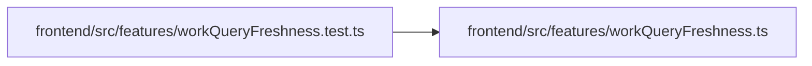

# workQueryFreshness.test Module

**Path:** `frontend/src/features/workQueryFreshness.test.ts`

## Description

_Auto-generated from `frontend/src/features/workQueryFreshness.test.ts`._

## Imports

| Source | Symbols |
|--------|---------|
| `./workQueryFreshness` | `installWorkFreshness` |
| `@tanstack/react-query` | `QueryClient`, `QueryObserver` |
| `vitest` | `expect`, `it` |

## Module Signals

| Signal | Values |
|--------|--------|
| Constants | `roots`, `cases` |
| Module calls | `cases = flatMap`, `it.each(cases)` |

## Local dependency map

<!-- Auto-generated local dependency summary. Do not edit by hand. -->

### Internal neighbors

| Direction | Module |
|---|---|
| Outbound | [workQueryFreshness](../modules/workQueryFreshness.md) |

### External packages

| Language | Used packages | Undeclared packages |
|---|---:|---:|
| typescript | 2 | 0 |
