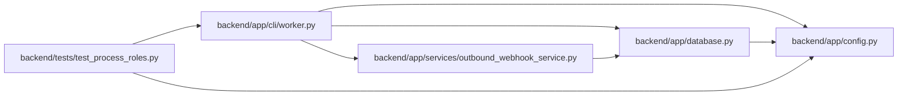

# worker Module

**Path:** `backend/app/cli/worker.py`

## Description

Dedicated durable outbound-delivery worker process.

## Imports

| Source | Symbols |
|--------|---------|
| `__future__` | `annotations` |
| `app.config` | `get_settings` |
| `app.database` | `close_database`, `init_db` |
| `app.services.outbound_webhook_service` | `outbound_delivery_worker_loop`, `run_due_outbound_delivery_jobs` |
| `argparse` | `argparse` |
| `asyncio` | `asyncio` |
| `signal` | `signal` |
| `sys` | `sys` |
| `typing` | `Optional` |

## Local dependency map

<!-- Auto-generated local dependency summary. Do not edit by hand. -->

### Internal neighbors

| Direction | Module |
|---|---|
| Inbound | [test_process_roles](../modules/test_process_roles.md) |
| Outbound | [config](../modules/config.md) |
| Outbound | [app_database](../modules/app_database.md) |
| Outbound | [outbound_webhook_service](../modules/outbound_webhook_service.md) |

## Functions

| Function | Signature | Decorators | Description |
|----------|-----------|------------|-------------|
| `build_parser` | `() -> argparse.ArgumentParser` | — | — |
| `_run` | *(async)* `(*, once: bool) -> int` | — | — |
| `main` | `(argv: Optional[list[str]] = None) -> int` | — | — |
