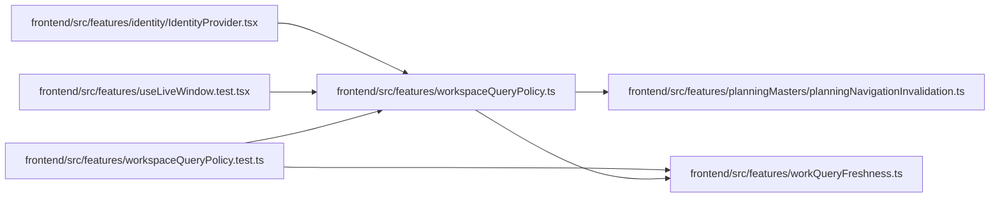

# workspaceQueryPolicy Module

**Path:** `frontend/src/features/workspaceQueryPolicy.ts`

## Description

Creates the identity/access-scoped workspace client and installs both shared work freshness and planning navigation invalidation on that client. Disposal unsubscribes both listeners, cancels pending requests and clears the old cache, preventing old-account responses from entering replacement access state. The outer shell client retains identity ownership without duplicate work-policy registration.

## Imports

| Source | Symbols |
|--------|---------|
| `./planningMasters/planningNavigationInvalidation` | `installPlanningNavigationInvalidation` |
| `./workQueryFreshness` | `installWorkFreshness` |
| `@tanstack/react-query` | `QueryClient` |

## Module Signals

| Signal | Values |
|--------|--------|
| Exports | `createWorkspaceQueryClient`, `installWorkspaceQueryPolicy` |

## Local dependency map

<!-- Auto-generated local dependency summary. Do not edit by hand. -->

### Internal neighbors

| Direction | Module |
|---|---|
| Inbound | [IdentityProvider](../modules/IdentityProvider.md) |
| Inbound | [useLiveWindow.test](../modules/useLiveWindow.test.md) |
| Inbound | [workspaceQueryPolicy.test](../modules/workspaceQueryPolicy.test.md) |
| Outbound | [planningNavigationInvalidation](../modules/planningNavigationInvalidation.md) |
| Outbound | [workQueryFreshness](../modules/workQueryFreshness.md) |

### External packages

| Language | Used packages | Undeclared packages |
|---|---:|---:|
| typescript | 1 | 0 |

## Functions

| Function | Signature | Decorators | Description |
|----------|-----------|------------|-------------|
| `createWorkspaceQueryClient` | `(accessKey: string)` | — | — |
| `installWorkspaceQueryPolicy` | `(client: QueryClient)` | — | — |
