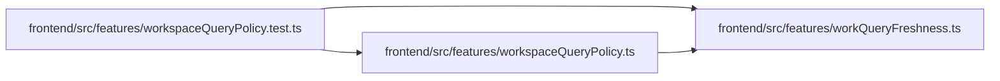

# workspaceQueryPolicy.test Module

**Path:** `frontend/src/features/workspaceQueryPolicy.test.ts`

## Description

_Auto-generated from `frontend/src/features/workspaceQueryPolicy.test.ts`._

## Imports

| Source | Symbols |
|--------|---------|
| `./workQueryFreshness` | `WORKSPACE_QUERY_POLICIES` |
| `./workspaceQueryPolicy` | `createWorkspaceQueryClient`, `installWorkspaceQueryPolicy` |
| `@tanstack/react-query` | `QueryObserver` |
| `vitest` | `expect`, `it`, `vi` |

## Module Signals

| Signal | Values |
|--------|--------|
| Module calls | `it.each(['hidden', 'disabled', 'unauthorized', 'too-many-pages'])`, `it`, `it`, `it`, `it` |

## Local dependency map

<!-- Auto-generated local dependency summary. Do not edit by hand. -->

### Internal neighbors

| Direction | Module |
|---|---|
| Outbound | [workQueryFreshness](../modules/workQueryFreshness.md) |
| Outbound | [workspaceQueryPolicy](../modules/workspaceQueryPolicy.md) |

### External packages

| Language | Used packages | Undeclared packages |
|---|---:|---:|
| typescript | 2 | 0 |
