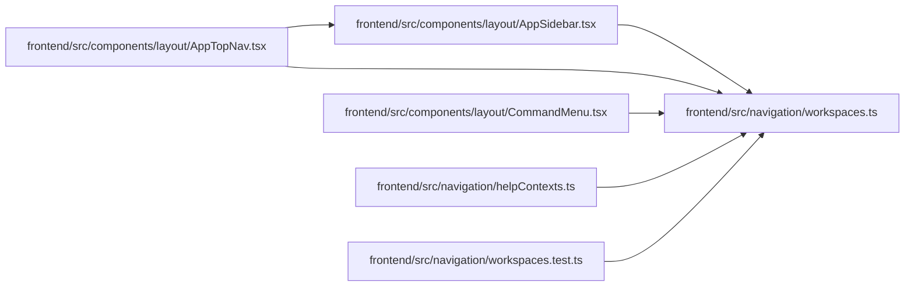

# workspaces Module

**Path:** `frontend/src/navigation/workspaces.ts`

## Description

_Auto-generated from `frontend/src/navigation/workspaces.ts`._

## Imports

| Source | Symbols |
|--------|---------|
| `lucide-react` | `LucideIcon`, `LayoutDashboard`, `Calendar`, `Inbox`, `Users`, `ListTodo`, `FolderOpen`, `Map`, `GanttChartSquare`, `Settings`, `Repeat`, `BarChart`, `Bot`, `MapPin`, `Network` |

## Module Signals

| Signal | Values |
|--------|--------|
| Exports | `NavItem`, `PRIMARY_NAV_ITEMS`, `WORKSPACES`, `WorkspaceKey`, `WorkspaceMetadata`, `getWorkspaceForPath`, `getWorkspaceFromPath` |
| Constants | `WORKSPACES`, `PRIMARY_NAV_ITEMS` |
| Module calls | `PRIMARY_NAV_ITEMS = flatMap` |

## Local dependency map

<!-- Auto-generated local dependency summary. Do not edit by hand. -->

### Internal neighbors

| Direction | Module |
|---|---|
| Inbound | [AppSidebar](../modules/AppSidebar.md) |
| Inbound | [AppTopNav](../modules/AppTopNav.md) |
| Inbound | [CommandMenu](../modules/CommandMenu.md) |
| Inbound | [helpContexts](../modules/helpContexts.md) |
| Inbound | [workspaces.test](../modules/workspaces.test.md) |

### External packages

| Language | Used packages | Undeclared packages |
|---|---:|---:|
| typescript | 1 | 0 |

## Classes

| Class | Kind | Line | Bases / Target | Description |
|-------|------|------|----------------|-------------|
| [NavItem](../entities/NavItem.md) | Class | 21 | — | — |
| [WorkspaceMetadata](../entities/WorkspaceMetadata.md) | Class | 29 | — | — |
| [WorkspaceKey](../entities/WorkspaceKey.md) | Type alias | 19 | — | — |

## Functions

| Function | Signature | Decorators | Description |
|----------|-----------|------------|-------------|
| `getWorkspaceFromPath` | `(pathname: string) -> WorkspaceKey` | — | — |
| `getWorkspaceForPath` | `(pathname: string) -> WorkspaceMetadata` | — | — |
